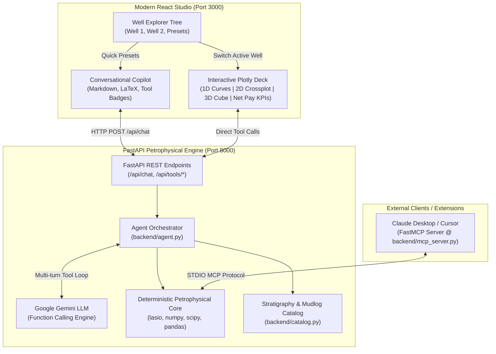
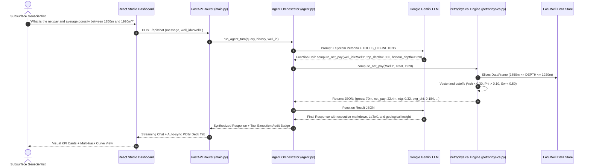

# 🗂️ Petrophysical Copilot: Autonomous Subsurface Analytics & RAG Engine

[](https://python.org) [](https://fastapi.tiangolo.com) [](https://react.dev) [](https://plotly.com) [](https://ai.google.dev) [](https://opensource.org/licenses/MIT)

An enterprise-grade, **hybrid agentic petrophysics platform** that pairs **Large Language Model (LLM) reasoning** with a **deterministic subsurface computing engine**. Designed with a modern energy-tech aesthetic (SLB Techlog & Palantir Foundry inspired), this platform enables geoscientists, reservoir engineers, and data teams to interactively explore raw well logs (.LAS), calculate cutoffs and fluid saturations, crossplot mineral matrices, and inspect 3D petrophysical spaces using conversational natural language or high-speed UI controls.

---

## 📑 Table of Contents

- [Core Capabilities: Real-Time Visualization, Retrieval & Computation](#core-capabilities-real-time-visualization-retrieval--computation)
- [Architectural Overview](#architectural-overview)
- [How the Backend Works](#how-the-backend-works)
- [Autonomous Tool Calling Engine](#autonomous-tool-calling-engine)
- [Complete Tool Catalog & Parameter Specifications](#complete-tool-catalog--parameter-specifications)
- [Agent Workflow & Conversational Execution](#agent-workflow--conversational-execution)
- [Limitations & Petrophysical Boundary Conditions](#limitations--petrophysical-boundary-conditions)
- [Quick Start Guide](#quick-start-guide)
- [MCP (Model Context Protocol) Integration](#mcp-model-context-protocol-integration)
- [Repository Structure](#repository-structure)

---

## 🎯 Core Capabilities: Real-Time Visualization, Retrieval & Computation

The platform is purpose-built to deliver **real-time visualization, retrieval, and computation of well log parameters directly from user natural language requests**:

| Pillar | Technical Mechanism | Subsurface Realization |
| :--- | :--- | :--- |
| **Real-Time Visualization** | High-performance Plotly.js + React 18 deck | • **1D Multi-Track Logs**: 3 synchronized tracks (GR/Caliper with washout & mudcake fills, log Resistivity, Density-Neutron crossover, synchronized spikeline depth correlation).<br>• **2D Lithology Crossplots**: Inverted RHOB vs NPHI with Quartz/Calcite/Dolomite calibration lines and Gas Correction Vector.<br>• **3D Cluster Space**: Snug petrophysical cube with mineral matrix sheet, floor/wall shadow projections, and 50%/80% density hulls.<br>• **3D Trajectory**: True spatial wellbore path ($X, Y, \text{TVDSS}$) with reservoir top formation surface. |
| **Subsurface Retrieval** | Stratigraphy Catalog + Dynamic LAS depth slicing | • **Tabular Log Retrieval**: Slicing raw `.las` curve arrays on-demand based on requested depth boundaries.<br>• **Geological Report Retrieval**: Catalog lookup for formation tops, stratigraphy summaries, and mudlog hydrocarbon show notes directly from well geology reports. |
| **Parameter Computation** | Vectorized deterministic Python engine | • **Volumetric Net Pay**: Gross interval, Net Reservoir, Net Pay, and Net-to-Gross ($NTG$).<br>• **Fluid Saturations**: Archie water saturation ($S_w$), hydrocarbon saturation ($S_o$), Bulk Volume Hydrocarbons ($BVH$).<br>• **Permeability & Flow**: Timur and Coates continuous permeability ($k$) and flow capacity ($k \cdot h$).<br>• **Porosity & Shale**: Wyllie time-average sonic porosity and multi-model $V_{\text{sh}}$ comparison (Linear, Larionov, Steiber, Clavier). |
| **Based on User Requests** | Autonomous Agentic Function Calling | • Plain English queries (e.g., *"Evaluate reservoir net pay and crossplot Well 2 between 3650m and 3750m"*) automatically trigger parameter extraction, deterministic tool execution, visual tab synchronization, and executive technical briefs in sub-second latency. |

---

## 🏗️ Architectural Overview



---

## ⚙️ How the Backend Works

The backend decouples **probabilistic reasoning** (LLM interpretation of intent) from **deterministic calculation** (petrophysical equations and spatial aggregations):



### 1. The Core Modules
- **`backend/main.py`**: High-throughput FastAPI application exposing REST endpoints for chat sessions, individual petrophysical calculations, and dynamic Plotly figure generation.
- **`backend/agent.py`**: The agent runtime. Maintains conversational state, formats petrophysical system prompts, sends strict OpenAPI tool schemas to Gemini, dispatches tool executions, and handles multi-turn loops until final synthesis is reached.
- **`backend/petrophysics.py`**: Pure, deterministic subsurface math engine. Uses `lasio` for high-fidelity LAS reading, standardizes mnemonic curve names (e.g. `CNC`, `NPHI` -> Neutron; `RHOB`, `DENB` -> Bulk Density), executes vector math via `numpy`/`scipy`, and builds responsive multi-track Plotly figures.
- **`backend/catalog.py`**: Stratigraphy and mudlog catalog. Indexes geological tops, formation summaries, and hydrocarbon mudlog shows with structured local metadata caching.
- **`backend/mcp_server.py`**: Model Context Protocol (MCP) implementation exposing all petrophysical routines to Claude Desktop, Cursor, or any MCP-compliant sidecar.

---

## 🛠️ Autonomous Tool Calling Engine

### Why Deterministic Tool Calling?
Language models struggle with precision floating-point calculations across tens of thousands of depth samples. Calculating cumulative reservoir pay over an interval of 5,000 depth rows requires strict mathematical evaluations:

$$\text{Net Pay} = \sum \Delta z \quad \text{where} \quad (V_{\text{sh}} \le V_{\text{cutoff}}) \land (\phi_e \ge \phi_{\text{cutoff}}) \land (S_w \le S_{w,\text{cutoff}})$$

Instead of asking the LLM to approximate mathematical values, **the LLM functions solely as an autonomous tool router**:
1. It analyzes the user query to extract parameters (well ID, interval bounds, cutoffs).
2. It calls the corresponding deterministic tool in `petrophysics.py`.
3. The deterministic tool executes vectorized math in NumPy/Pandas and returns exact JSON data.
4. The LLM translates the verified numbers into an executive technical brief.

---

## 🧰 Complete Tool Catalog & Parameter Specifications

<details>
<summary><b>1. <code>plot_1d_well_log</code> — Interactive Multi-Track Petrophysical Log</b></summary>

Generates an interactive 3-track Plotly log plot for a specified depth interval:
- **Track 1**: Gamma Ray (0–150/200 API), Caliper (6–16 in), Bit Size baseline, with subtle washout shading ($> BS$) and mudcake buildup shading ($< BS$).
- **Track 2**: Resistivity curves (RDEEP, RMED, RSHAL) on a 4-decade logarithmic scale ($0.2\text{--}2000\,\Omega\cdot\text{m}$).
- **Track 3**: Density-Neutron crossover on standard SPWLA dual scale ($\text{RHOB}\;1.95\text{--}2.95\,\text{g/cm}^3$ overlaid on reversed $\text{NPHI}\;0.45\text{--}-0.15\,\text{v/v}$), highlighted with golden gas/sand crossover polygon fills.
- **Marker**: Optional red dashed horizontal correlation line with depth tag (`Depth: XXXX.Xm`).

| Parameter | Type | Required | Default | Description |
| :--- | :--- | :--- | :--- | :--- |
| `well_id` | `STRING` | **Yes** | — | Identifier of the well (e.g., `'Well1'`, `'Well2'`) |
| `top_depth` | `NUMBER` | No | Full log top | Starting depth in meters |
| `bottom_depth`| `NUMBER` | No | Full log base| Ending depth in meters |
| `marker_depth`| `NUMBER` | No | Auto-centered | Depth for continuous correlation line |
| `curves` | `ARRAY[STR]`| No | All available | Specific curve mnemonics to render |
</details>

<details>
<summary><b>2. <code>plot_2d_crossplot</code> — Lithology Mineral Matrix Crossplot</b></summary>

Generates an interactive 2D lithology crossplot with mineral trendlines:
- Plots Bulk Density ($\text{RHOB}$) vs. Neutron Porosity ($\text{NPHI}$), color-coded by Gamma Ray ($\text{GR}$) or Sonic ($\text{DT}$).
- Automatically inverts the Density axis (standard petrophysical presentation).
- Overlays Quartz ($2.65\,\text{g/cm}^3$), Calcite ($2.71\,\text{g/cm}^3$), and Dolomite ($2.87\,\text{g/cm}^3$) matrix calibration lines.
- **Gas Effect Vector**: Automatically detects low-density/low-neutron gas clusters and displays a diagonal correction arrow pointing toward the sandstone matrix.

| Parameter | Type | Required | Default | Description |
| :--- | :--- | :--- | :--- | :--- |
| `well_id` | `STRING` | **Yes** | — | Well identifier |
| `x_curve` | `STRING` | **Yes** | — | Mnemonic for X-axis (e.g., `'NEUT'`, `'NPHI'`) |
| `y_curve` | `STRING` | **Yes** | — | Mnemonic for Y-axis (e.g., `'DENB'`, `'RHOB'`) |
| `z_curve` | `STRING` | No | `'GR'` | Color dimension mnemonic |
| `top_depth` | `NUMBER` | No | None | Top depth boundary in meters |
| `bottom_depth`| `NUMBER` | No | None | Bottom depth boundary in meters |
</details>

<details>
<summary><b>3. <code>compute_net_pay</code> — Volumetric Cutoff & Reservoir Net Pay Engine</b></summary>

Applies strict volumetric cutoff criteria across depth arrays:
- **Gross Thickness ($h$)**: Total measured thickness of the interval.
- **Net Reservoir**: Interval meeting Shale Volume cutoff ($V_{\text{sh}} \le 0.30$).
- **Net Pay**: Reservoir meeting Porosity ($\phi_e \ge 0.10$) and Water Saturation ($S_w \le 0.50$) criteria.
- **Net-to-Gross (NTG)**: $\frac{\text{Net Pay}}{\text{Gross}}$.

| Parameter | Type | Required | Default | Description |
| :--- | :--- | :--- | :--- | :--- |
| `well_id` | `STRING` | **Yes** | — | Well identifier |
| `top_depth` | `NUMBER` | **Yes** | — | Top depth in meters |
| `bottom_depth`| `NUMBER` | **Yes** | — | Bottom depth in meters |
| `vsh_cutoff` | `NUMBER` | No | `0.30` | Maximum allowable shale volume fraction |
| `phi_cutoff` | `NUMBER` | No | `0.10` | Minimum allowable effective porosity fraction |
| `sw_cutoff` | `NUMBER` | No | `0.50` | Maximum allowable water saturation fraction |
</details>

<details>
<summary><b>4. <code>plot_3d_petrophysical_cube</code> — 3D Cluster Space & Mineral Matrix Sheet</b></summary>

Builds an advanced 3D petrophysical inspection space:
- **X-Axis**: Neutron Porosity ($\text{NPHI}$, $\text{v/v}$)
- **Y-Axis**: Bulk Density ($\text{RHOB}$, $\text{g/cm}^3$, reversed)
- **Z-Axis**: Compressional Slowness ($\text{DT}$, $\mu\text{s/ft}$)
- Features 3D Mineral Matrix surfaces (Quartz, Calcite, Dolomite sheet), projected 2D floor/wall shadow contours, volumetric 50% core and 80% containment isosurface envelopes, and toggleable discrete lithofacies (Clean Gas Pay, Clean Water Sand, Shaly Sand, Shale/Clay, Tight Carbonate).

| Parameter | Type | Required | Default | Description |
| :--- | :--- | :--- | :--- | :--- |
| `well_id` | `STRING` | **Yes** | — | Well identifier |
| `top_depth` | `NUMBER` | No | Full log | Optional top depth boundary |
| `bottom_depth`| `NUMBER` | No | Full log | Optional bottom depth boundary |
</details>

<details>
<summary><b>5. <code>plot_3d_wellbore_trajectory</code> — True 3D Spatial Wellbore & Pay Horizon</b></summary>

Renders the true 3D spatial trajectory ($X, Y, \text{TVDSS}$) using minimum curvature calculation, colored by hydrocarbon pay flags and framed by the regional reservoir top formation surface.

| Parameter | Type | Required | Default | Description |
| :--- | :--- | :--- | :--- | :--- |
| `well_id` | `STRING` | **Yes** | — | Well identifier |
| `top_depth` | `NUMBER` | No | Full log | Interval start |
| `bottom_depth`| `NUMBER` | No | Full log | Interval end |
</details>

<details>
<summary><b>6. <code>calculate_archie_saturation</code> — Archie Water Saturation ($S_w$)</b></summary>

Computes continuous water saturation ($S_w$), hydrocarbon saturation ($S_o = 1 - S_w$), and Bulk Volume Hydrocarbon ($\text{BVH} = \phi \times (1 - S_w)$):

$$S_w = \left(\frac{a \cdot R_w}{\phi^m \cdot R_t}\right)^{1/n}$$

| Parameter | Type | Required | Default | Description |
| :--- | :--- | :--- | :--- | :--- |
| `well_id` | `STRING` | **Yes** | — | Well identifier |
| `top_depth` | `NUMBER` | **Yes** | — | Top depth in meters |
| `bottom_depth`| `NUMBER` | **Yes** | — | Bottom depth in meters |
| `rw` | `NUMBER` | No | `0.05` | Formation water resistivity ($\Omega\cdot\text{m}$) |
| `m` | `NUMBER` | No | `2.0` | Cementation exponent |
| `n` | `NUMBER` | No | `2.0` | Saturation exponent |
</details>

<details>
<summary><b>7. <code>compute_permeability_timur_coates</code> — Continuous Permeability & Flow Capacity</b></summary>

Calculates continuous reservoir permeability ($k$ in mD) and cumulative flow capacity ($k \cdot h$ in $\text{mD}\cdot\text{m}$) using the Timur or Coates empirical models:

$$\text{Timur:}\quad k = 0.136 \cdot \frac{\phi^{4.4}}{S_{wir}^2} \qquad \text{Coates:}\quad k = 10^4 \cdot \phi^4 \cdot \left(\frac{1 - S_{wir}}{S_{wir}}\right)^2$$

| Parameter | Type | Required | Default | Description |
| :--- | :--- | :--- | :--- | :--- |
| `well_id` | `STRING` | **Yes** | — | Well identifier |
| `top_depth` | `NUMBER` | **Yes** | — | Top depth in meters |
| `bottom_depth`| `NUMBER` | **Yes** | — | Bottom depth in meters |
| `model` | `STRING` | No | `'timur'` | Empirical model (`'timur'` or `'coates'`) |
</details>

<details>
<summary><b>8. <code>compare_vshale_methods</code> — Multi-Model Shale Volume Evaluation</b></summary>

Compares 4 established non-linear $V_{\text{sh}}$ models against linear Gamma Ray index:
1. **Linear**: $V_{\text{sh}} = I_{GR}$
2. **Larionov (Tertiary)**: $V_{\text{sh}} = 0.083 \cdot (2^{3.7 \cdot I_{GR}} - 1)$
3. **Steiber**: $V_{\text{sh}} = \frac{I_{GR}}{3 - 2 \cdot I_{GR}}$
4. **Clavier**: $V_{\text{sh}} = 1.7 - \sqrt{3.38 - (I_{GR} + 0.7)^2}$
</details>

<details>
<summary><b>9. <code>compute_sonic_porosity_wyllie</code> — Wyllie Time-Average Porosity</b></summary>

Computes matrix sonic porosity from compressional acoustic transit time ($DT$ in $\mu\text{s/ft}$) and evaluates compaction factors:

$$\phi_S = \frac{\Delta t_{\text{log}} - \Delta t_{\text{matrix}}}{\Delta t_{\text{fluid}} - \Delta t_{\text{matrix}}}$$
</details>

<details>
<summary><b>10. <code>scan_reservoir_sweetspots</code> — Autonomous Pay Interval Delineation</b></summary>

Scans the entire well depth series, identifies all continuous pay packages exceeding minimum thickness thresholds (default: $\ge 1.5\,\text{m}$), and ranks sweet spots by Net Pay and Hydrocarbon Pore Volume ($HCPV$).
</details>

<details>
<summary><b>11. <code>plot_crossplot_picket</code> — Classic Archie Picket Plot</b></summary>

Constructs a logarithmic resistivity vs. porosity crossplot with 100% $S_w$ water line and iso-saturation lines ($S_w = 20\%, 30\%, 50\%$) to graphically confirm formation water resistivity ($R_w$) and cementation factor ($m$).
</details>

<details>
<summary><b>12. <code>generate_reservoir_composite_report</code> — Executive Zonal Dossier</b></summary>

Generates an all-in-one reservoir summary table combining gross interval, net pay, NTG, average porosity, fluid saturations, flow capacity ($k \cdot h$), and fluid classification.
</details>

<details>
<summary><b>13. <code>get_well_curves_summary</code> — LAS Header & Curve Inspection</b></summary>

Inspects the raw LAS file for a given well and returns available mnemonics, depth boundaries, units, and curve descriptions.
</details>

<details>
<summary><b>14. <code>query_geology_metadata</code> — Stratigraphy & Mudlog Report Retrieval</b></summary>

Queries the stratigraphy catalog for geological formations, stratigraphy tops, core descriptions, and mudlog hydrocarbon show notes.
</details>

---

## 🤖 Agent Workflow & Conversational Execution

### 1. Multi-Turn Autonomous Reasoning
When a user asks a complex question (e.g. *"Evaluate the main reservoir in Well 2: calculate net pay, show the lithology crossplot, and check if any gas effect is present"*), the agent performs an autonomous multi-step reasoning plan:

```
Step 1: Identify targets -> Well: 'Well2', Key interval: ~3650m - 3750m.
Step 2: Tool Call 1 -> compute_net_pay(well_id='Well2', top_depth=3650, bottom_depth=3750)
Step 3: Tool Call 2 -> plot_2d_crossplot(well_id='Well2', x_curve='NEUT', y_curve='DENB', z_curve='GR')
Step 4: Receive payloads -> Net pay = 28.5m, Gas Correction Vector detected in low-DENB cluster.
Step 5: Synthesize executive summary with markdown, KPI highlights, and guidance.
```

### 2. UI Synchronization & Active Well Binding
The React interface keeps visual components synchronized with the agent:
- **Badge Audit Trail**: Every tool invoked by the agent renders as a clickable, expandable badge (`⚙️ compute_net_pay`, `🔍 query_geology_metadata`) showing exact inputs and outputs.
- **Synchronized Tab Switching**: Invoking a 2D crossplot or 3D cube automatically surfaces the corresponding tab in the right-hand inspection deck.
- **Active Well Binding**: Changing the selected well in the sidebar updates the context of the copilot. Clicking well toggles directly inside Plotly plots triggers cross-component synchronization.

---

## ⚠️ Limitations & Petrophysical Boundary Conditions

To maintain engineering integrity, users should note the following physical and system limitations:

<details>
<summary><b>1. Petrophysical Model Assumptions & Formations</b></summary>

- **Clastic Lithology Focus**: Matrix trendlines default to clean sandstones ($2.65\,\text{g/cm}^3$), limestones ($2.71\,\text{g/cm}^3$), and dolomites ($2.87\,\text{g/cm}^3$). Complex non-clastic evaporites (anhydrite, halite) or heavy mineral assemblages (pyrite, siderite) require custom matrix calibrations.
- **Archie Clean Sand Limitation**: Archie saturation equations assume non-conductive rock matrices and clean formation water. In high-clay shaly sands, excessive clay surface conductivity can cause Archie to overestimate water saturation ($S_w$). In such reservoirs, Waxman-Smits or Dual-Water models should be utilized.
- **Empirical Permeability**: Timur and Coates models are calibrated for clean, consolidated sandstones with irreducible water saturation. Carbonates with vuggy or fracture porosity require core-calibrated permeability transforms.
</details>

<details>
<summary><b>2. Log Data Availability & Graceful Fallbacks</b></summary>

- **Missing Caliper**: If a physical caliper curve (`CALI`) is missing from the LAS file, Track 1 defaults to an estimated bit size gauge baseline ($8.5''$ or $12.25''$) based on depth.
- **Missing Sonic**: 3D cluster cube plotting requires compressional sonic (`DTCOMP` / `DT`). If missing, standard regional defaults ($85\,\mu\text{s/ft}$) are substituted.
- **Bed Resolution**: Standard induction resistivity logs have vertical resolution limitations (~1.5–2.0m). Pay zones thinner than 0.5m may experience bed-boundary averaging (shoulder bed effects).
</details>

<details>
<summary><b>3. Large Context Windows & Token Limits</b></summary>

- Raw 1-second or 0.1524m log sampling over a 3,000m well produces over 20,000 depth rows. Transmitting raw tabular arrays directly to the LLM would overwhelm context windows and cause hallucinated calculations.
- **Strict Boundary**: All raw data slicing, filtering, and statistical aggregations occur on the server in Python. The LLM receives compact JSON summaries and statistical metrics, guaranteeing 100% deterministic accuracy.
</details>

---

## 🚀 Quick Start Guide

### Prerequisites
- **Python**: 3.10 or higher
- **Node.js**: 18.0 or higher
- **Google Gemini API Key**: [Get a free key here](https://aistudio.google.com/)

### Step 1: Clone Repository
```bash
git clone https://github.com/Ovar9000/Petrophysics-Copilot.git
cd Petrophysics-Copilot
```

### Step 2: Configure Environment
Copy the example environment configuration:
```bash
cp .env.example .env
```

Edit `.env` and provide your `GEMINI_API_KEY`:
```ini
GEMINI_API_KEY=AIzaSyYourActualKeyHere
GEMINI_MODEL=gemini-2.5-flash
DATA_DIR=data
BACKEND_HOST=127.0.0.1
BACKEND_PORT=8000
FRONTEND_PORT=3000
```

### Step 3: Add Well Data
Place your `.las` well log files in the `data/` directory (e.g. `data/Well1.las`, `data/Well2.las`).
*(Note: `.las` files are ignored by git to protect proprietary subsurface assets).*

### Step 4: Launch Platform
Run the dual-server launcher:
```powershell
# Windows PowerShell
.\.venv\Scripts\python.exe run.py

# Linux / macOS
python run.py
```

Open your browser:
- **React Studio Dashboard**: `http://localhost:3000`
- **FastAPI Interactive Docs**: `http://127.0.0.1:8000/docs`

---

## 🔌 MCP (Model Context Protocol) Integration

The platform includes a native **MCP Server** (`backend/mcp_server.py`) that exposes the entire deterministic petrophysical engine to external LLM clients such as **Claude Desktop**, **Cursor**, or **AI Sidecars**.

### Claude Desktop Configuration
Add the following snippet to your `claude_desktop_config.json`:

```json
{
  "mcpServers": {
    "petrophysical-copilot": {
      "command": "python",
      "args": [
        "c:/Users/YourUser/path/to/well_log_rag_analytics/backend/mcp_server.py"
      ],
      "env": {
        "DATA_DIR": "c:/Users/YourUser/path/to/well_log_rag_analytics/data"
      }
    }
  }
}
```

Once configured, Claude can autonomously execute petrophysical calculations, slice intervals, and evaluate net pay directly in conversational workflows.

---

## 📁 Repository Structure

```
well_log_rag_analytics/
├── .env.example                # Template for environment variables and API keys
├── .gitignore                  # Excludes proprietary .LAS logs, virtualenvs, & builds
├── README.md                   # Interactive documentation and architectural guide
├── requirements.txt            # Python dependencies (lasio, fastapi, plotly, mcp, etc.)
├── run.py                      # Multi-process orchestrator (FastAPI + Vite React)
│
├── backend/                    # High-performance petrophysical computation
│   ├── agent.py                # Autonomous agent loop, Gemini function calling
│   ├── catalog.py              # Geological stratigraphy & mudlog metadata catalog
│   ├── config.py               # Central environment and path loader
│   ├── main.py                 # FastAPI REST API endpoints & CORS middleware
│   ├── mcp_server.py           # Model Context Protocol server for AI clients
│   └── petrophysics.py         # Deterministic subsurface math & Plotly figure generator
│
├── data/                       # Subsurface data store
│   ├── .gitkeep                # Preserves folder in git
│   ├── Well1_geology_report.md # Geological stratigraphy & mudlog notes
│   └── Well2_geology_report.md # Geological stratigraphy & mudlog notes
│
├── frontend-react/             # Production React 18 + TypeScript + Tailwind Studio
│   ├── index.html              # HTML entry point
│   ├── package.json            # Node dependencies
│   ├── vite.config.ts          # Vite configuration & proxy routes
│   └── src/
│       ├── App.tsx             # Three-panel layout orchestrator
│       ├── components/
│       │   ├── ChatInterface.tsx # Conversational copilot with streaming & badges
│       │   ├── PlotlyDeck.tsx    # 1D/2D/3D multi-tab Plotly visualization deck
│       │   └── Sidebar.tsx       # Well tree, depth intervals, & analytical presets
│
└── tests/                      # Automated test suite
    └── test_petrophysics.py    # Unit tests for cutoffs, Archie, Vshale, & crossplots
```

---

## 📄 License

This project is licensed under the [MIT License](LICENSE).
